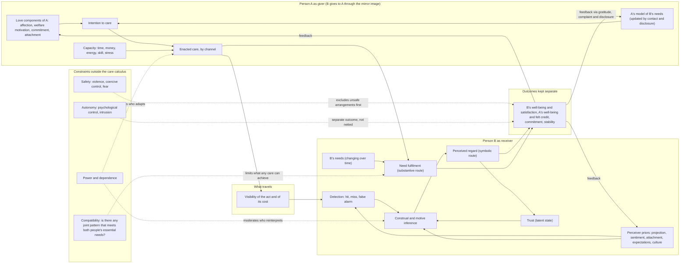

# Figure 1 as Mermaid source

Editable source of the model diagram. GitHub renders it below; the curated rendering is [`model.svg`](model.svg).

```mermaid
flowchart LR
  subgraph GIVER["Person A as giver (B gives to A through the mirror image)"]
    L["Love components of A: affection, welfare motivation, commitment, attachment"]
    M["A's model of B's needs (updated by contact and disclosure)"]
    I["Intention to care"]
    C["Capacity: time, money, energy, skill, stress"]
    E["Enacted care, by channel"]
  end
  subgraph SIGNAL["What travels"]
    V["Visibility of the act and of its cost"]
  end
  subgraph RECEIVER["Person B as receiver"]
    P0["Perceiver priors: projection, sentiment, attachment, expectations, culture"]
    T["Trust (latent state)"]
    D["Detection: hit, miss, false alarm"]
    K["Construal and motive inference"]
    R["Perceived regard (symbolic route)"]
    N["B's needs (changing over time)"]
    S["Need fulfilment (substantive route)"]
  end
  subgraph OUT["Outcomes kept separate"]
    Y["B's well-being and satisfaction, A's well-being and felt credit, commitment, stability"]
  end
  subgraph LIMITS["Constraints outside the care calculus"]
    SAFE["Safety: violence, coercive control, fear"]
    AUT["Autonomy: psychological control, intrusion"]
    POW["Power and dependence"]
    FEAS["Compatibility: is there any joint pattern that meets both people's essential needs?"]
  end
  L --> I
  M --> I
  I --> E
  C --> E
  E --> V
  V --> D
  D --> K
  K --> R
  R --> Y
  E --> S
  N --> S
  S --> Y
  P0 --> D
  P0 --> K
  T --> K
  R --> T
  Y -->|feedback via gratitude, complaint and disclosure| M
  Y -->|feedback| L
  Y -->|feedback| P0
  SAFE -.->|excludes unsafe arrangements first| Y
  AUT -.->|separate outcome, not netted| Y
  POW -.->|moderates who adapts| E
  POW -.->|moderates who reinterprets| K
  FEAS -.->|limits what any care can achieve| S
```
